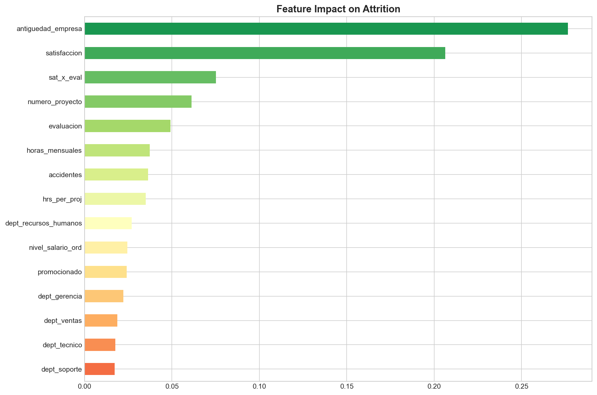
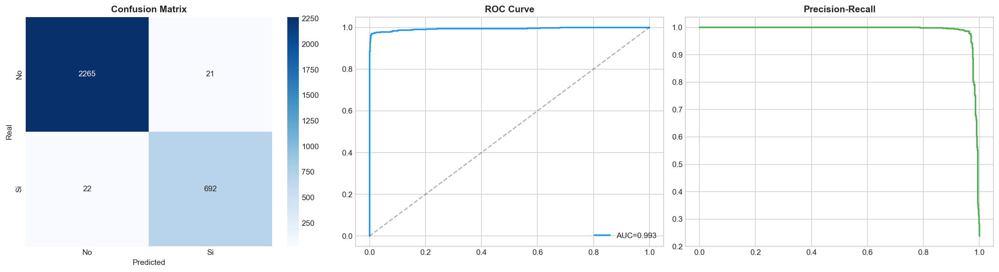
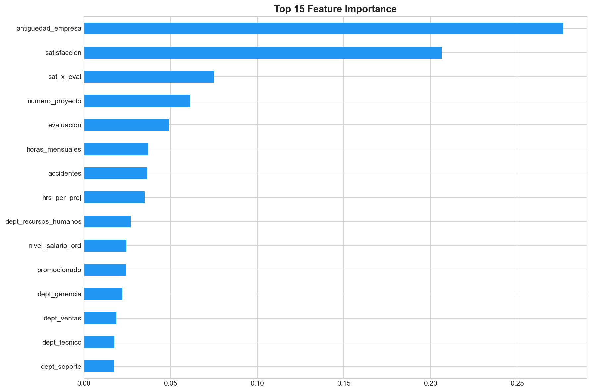

# Employee Attrition Predictor: XGBoost + SHAP Explanations


<p align="center">
  
</p>

## Business Context

Employee turnover costs organizations between **50-200% of the departing employee's annual salary**. This project builds a predictive model that identifies employees at risk of leaving **before they resign**, enabling proactive retention interventions.

The model uses **XGBoost** for prediction and **SHAP** for full explainability, making it actionable for HR teams — not just data scientists.

## Key Results

| Metric | Value |
|--------|-------|
| Dataset | ~15,000 employees |
| Attrition rate | ~24% |
| AUC-ROC | >0.95 |
| Cross-validation | 5-fold stratified |

### Risk Factors Identified (via SHAP)

| Factor | Impact |
|--------|--------|
| Low satisfaction | Strongest predictor of departure |
| High monthly hours (>240) | Burnout signal |
| Many simultaneous projects (>5) | Overwork indicator |
| Low salary + high tenure | Compensation mismatch |
| No promotion in 5 years | Career stagnation |

## Visualizations

<p align="center">
  
  <br><em>Confusion Matrix, ROC Curve, and Precision-Recall</em>
</p>

<p align="center">
  
  <br><em>Global feature importance via SHAP values</em>
</p>

## Project Structure

```
employee-attrition-predictor/
├── README.md
├── notebooks/
│   └── employee_attrition.ipynb   # Full analysis with SHAP explanations
├── data/
│   └── empleados.xlsx             # 15K employee records
├── outputs/
│   └── figures/                   # Exported visualizations
├── requirements.txt
├── LICENSE
└── .gitignore
```

## Methodology

1. **EDA** — Distribution analysis by attrition status, department, salary level
2. **Feature Engineering** — Interaction terms, overwork flags, ordinal encoding
3. **XGBoost** — Gradient boosting with class imbalance handling
4. **Cross-Validation** — 5-fold stratified for robust metrics
5. **SHAP Analysis** — Global importance + individual explanations
6. **Risk Profiling** — Actionable segmentation for HR teams

## Quick Start

```bash
git clone https://github.com/EduardoMoraga/employee-attrition-predictor.git
cd employee-attrition-predictor
pip install -r requirements.txt
jupyter notebook notebooks/employee_attrition.ipynb
```

## Tech Stack

- **XGBoost** — Gradient boosting classifier
- **SHAP** — Model explainability
- **scikit-learn** — Preprocessing, evaluation, cross-validation
- **pandas / numpy** — Data manipulation
- **matplotlib / seaborn** — Visualization

## About the Author

**Eduardo Moraga** — Economist & Data Scientist specializing in Trade Marketing and Business Intelligence. Currently leading BI and AI-driven optimization at [Increxa](https://increxa.com/) across LATAM.

[](https://www.linkedin.com/in/eduardomoragaortega/)
[](https://github.com/EduardoMoraga)

---

*Part of my [Data Science Portfolio](https://github.com/EduardoMoraga) — Real-world projects at the intersection of Trade Marketing, Data Science, and AI.*
